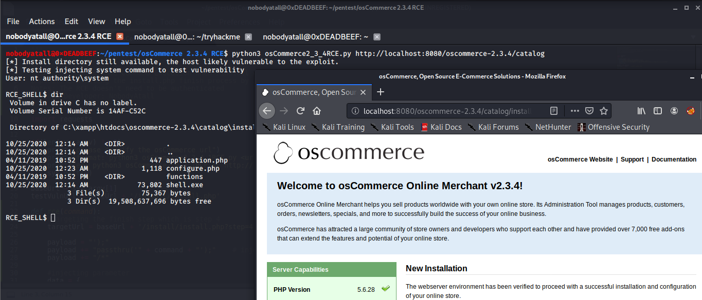

# osCommerce 2.3.4 Remote Command Execution

Web Application: osCommerce

Version Tested: 2.3.4

Vulnerability: Remote Command Execution when /install directory wasn't removed by the admin

Exploit: Exploiting the install.php finish process by injecting php payload into the db_database parameter & read the system command output from configure.php

Notes: The RCE doesn't need to be authenticated

